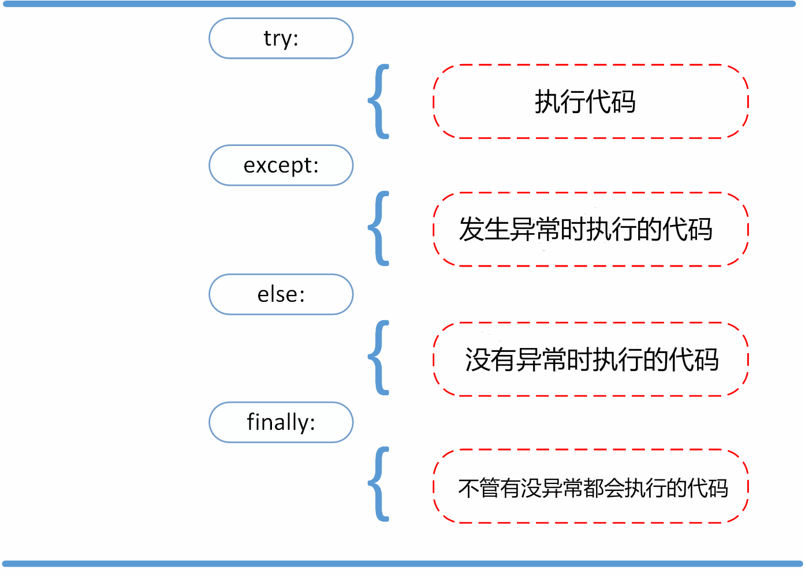

# 异常处理

try 语句按照如下方式工作；

- 首先，执行 try 子句（在关键字 try 和关键字 except 之间的语句）。
- 如果没有异常发生，忽略 except 子句，try 子句执行后结束。
- 如果在执行 try 子句的过程中发生了异常，那么 try 子句余下的部分将被忽略。如果异常的类型和 except 之后的名称相符，那么对应的 except 子句将被执行。
- 如果一个异常没有与任何的 except 匹配，那么这个异常将会传递给上层的 try 中。



else和finally都是可选的

```
for arg in sys.argv[1:]:
    try:
        f = open(arg, 'r')
    except IOError:
        print('cannot open', arg)
    else:
        print(arg, 'has', len(f.readlines()), 'lines')
        f.close()
```

```
>>> def this_fails():
        x = 1/0
   
>>> try:
        this_fails()
    except ZeroDivisionError as err:
        print('Handling run-time error:', err)
   
Handling run-time error: int division or modulo by zero
```

**finally无论程序运行到那里，finally里面的都会被执行**

```
#!/usr/bin/python3
import sys

try:
    sys.exit(1)#这里已经退出但是finally还是会被执行
    print("try")
    
finally:
    print("finally")
```


# 抛出异常

Python 使用 raise 语句抛出一个指定的异常。

raise语法格式如下：

```
raise [Exception [, args [, traceback]]]
如：
raise
raise ZeroDivisionError
raise ZeroDivisionError("除数不能为零") #这种方式用的比较多
```

以下实例如果 x 大于 5 就触发异常:

```
x = 10
if x > 5:
	raise Exception('x 不能大于 5。x 的值为: {}'.format(x))
```

执行以上代码会触发异常：

```
Traceback (most recent call last):
  File "test.py", line 3, in <module>
    raise Exception('x 不能大于 5。x 的值为: {}'.format(x))
Exception: x 不能大于 5。x 的值为: 10
```

常见应用方式：

```
def factorial(num):
    try:
        if num < 0 or type(num) != int:
            raise Exception("该数不能阶乘")
    	else:
            return num * factorial(num-1)
    except Exception as e:
        print(e)

```


# 处理异常示例

抛出异常和处理异常就可以组合来用

如：

```
try:
    raise NameError('HiThere')
except NameError:
    print('An exception flew by!')
   	raise # 如果不想处理就在加个raise，再次抛出这个异常
```


# 自定义异常

你可以通过创建一个新的异常类来拥有自己的异常。异常类继承自 Exception 类，可以直接继承，或者间接继承，例如:

```
class MyError(Exception):
	def __init__(self, value):
		self.value = value
	def __str__(self):
		return repr(self.value)
try:
	raise MyError(2*2)
except MyError as e:
	print('My exception occurred, value:', e.value)

输出：
My exception occurred, value: 4
>>> raise MyError('oops!')
Traceback (most recent call last):
  File "<stdin>", line 1, in ?
__main__.MyError: 'oops!'
```


# 清理行为

一些对象定义了标准的清理行为，无论系统是否成功的使用了它，一旦不需要它了，那么这个标准的清理行为就会执行。

这面这个例子展示了尝试打开一个文件，然后写入内容:

```
file = open('./test_runoob.txt', 'w')
file.write('hello world !')
file.close()
```

以上这段代码的问题是，当执行完毕后，文件会保持打开状态，并没有被关闭。

可以使用try...finally...在finally里面清理

```
file = open('./test_runoob.txt', 'w')
try:
    file.write('hello world')
finally:
    file.close()
```

以上代码我们对可能发生异常的代码处进行 try 捕获，发生异常时执行 except 代码块，finally 代码块是无论什么情况都会执行，所以文件会被关闭，不会因为执行异常而占用资源。

## with关键字

也可以使用with，关键词 with 语句就可以保证诸如文件之类的对象在使用完之后一定会正确的执行他的清理方法:

```
with open('./test_runoob.txt', 'w') as file:
    file.write('hello world !')
```

以上这段代码执行完毕后，就算在处理过程中出问题了，文件 f 总是会关闭。

**打开文件读写、用pickle包完成数据的存储、恢复的操作，都非常适合使用with语句。**

```
try:
    with open("phone.pickle", "wb") as outf:
        pickle.dump("13193388105", outf)
except:
    print("file have errow.")


try:
    with open("phone.pickle", "rb") as outf:
        data = pickle.load(outf)
        print(type(data))
        print(data)
except:
    print("file have errow.")

```

- 采用with语句的代码更简洁；
- 防止因为忘记写f.close()而引发的错误；
- 一个对象（上下文）的操作有进入、退出过程就可以抽取出来，并做成自动化执行；


